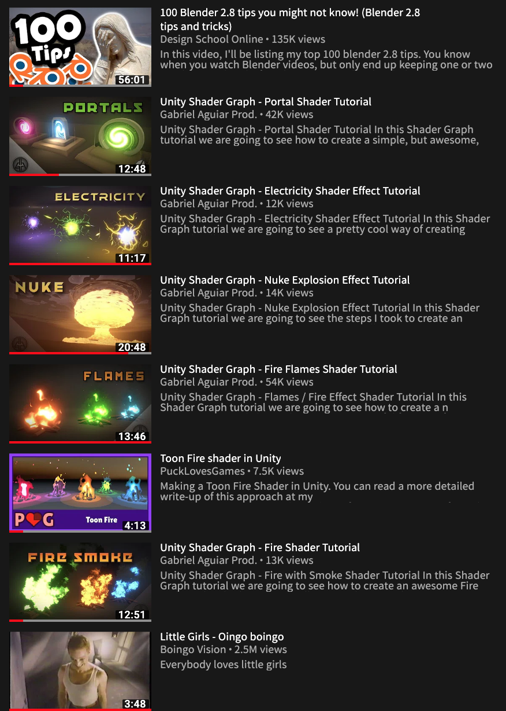
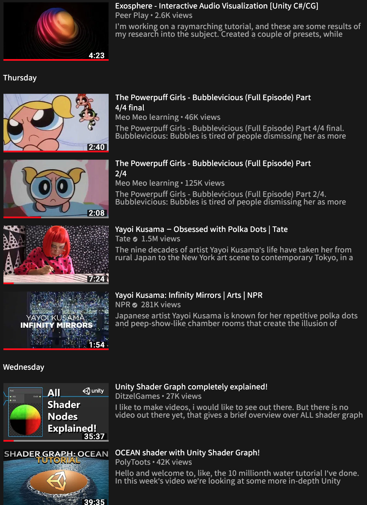
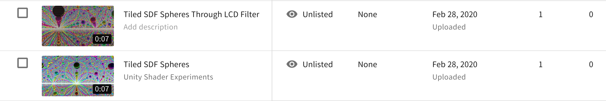

# Day 1 
## Youtube account swap

### Concept:
Treating Youtube as a digital realm where my identity consisted mainly of my video viewing preferences. Then trying to mix up the representation by having some other individual inhabit my account for a certain amount of time, to observe the changes occured and document the impact on myself in post.

I gave my youtube acount to a fellow DT student for 5 days, with the following instructions:

* Don't click on the default recommends
* If you feel like its recommended to you according to **your** previous choices, then its ok to click
* Subscribe to anyone at your will, it can also be channels you already subbed to
* Upload/comments/set notifications/rate at will
       > if interact with inputs, don't acknowledge the existence of the experiment. 

* Just be your self

### Projected results:

* A "somewhat" reformed Youtube personal home page, with recommendations for both of my old (original) ID and the newly introduced.
* A observable inconsistancy on what the algrithism had predicted my next or habit of videos are.
* Diverse recorded viewing history throughout the process.
* New uploads / comments / likes .......(social engagements performed by the DT fellow.

### Result:

* No obserable recommendations for the new user untill the 7th line at home page.
* New diversed viewing history (shaders tutorial, power puff girls...).
* No new subscriptions, comments...

### Conclusion:

Originally inspired by my own experience where I forgot to signout my account and I started seeing seemingly irrelevant contents popping up in my recommendations, this experienmt was my attempt to recreate that feeling of surreality.

Yet the final result almost didn't make a dent, due to my ongoing high volume subcriptions and content refreshments the home page ended up being a place with pipped up unwatched videos of my subed channels.

I was able to capture a fraction of the concept with my uploads (in which I have no idea what "shader" means), and my watched history.

