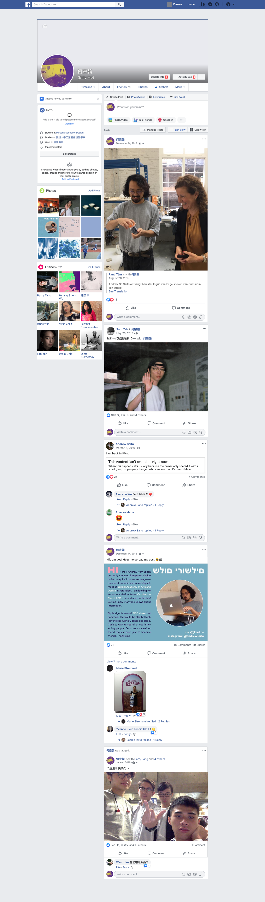

# Day 3
## Token/memory swap

The idea of memory being a vital part of identity, and the new realms technology had enabled us to document our experiences represented by tokens. 
I tried to create a concept of browser extension that will mix up your personal social media recorded history with someone else.

Link to the xd file:
(assets/Ms2personal.xd)

